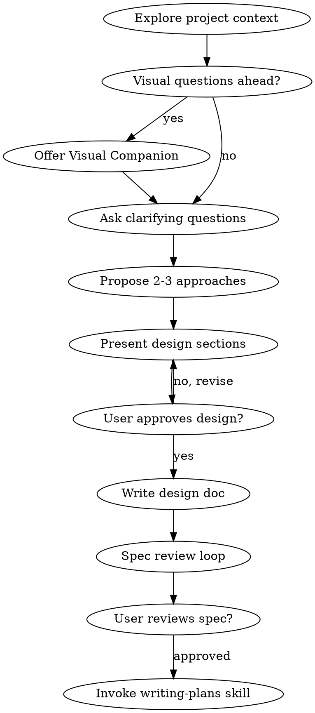
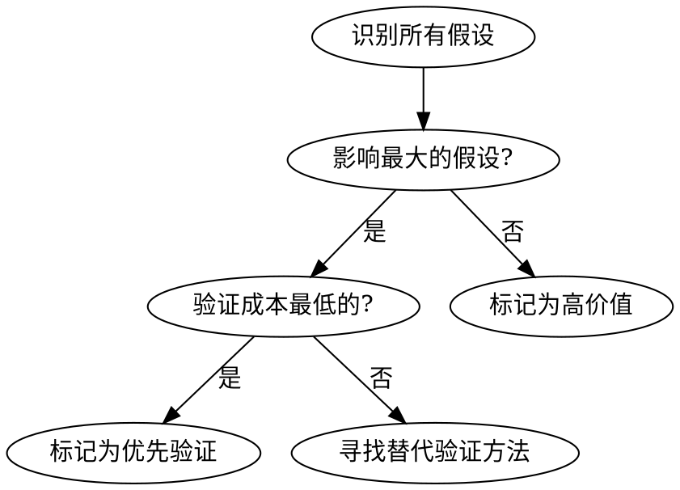

# GSD & Superpowers 深度研究报告

> 研究时间：2026-03-12
> 目的：为 AOP MVP 生成器优化寻找可借鉴的设计模式和具体实现方案

---

## 一、项目概览（精简版）

### 1.1 Get Shit Done (GSD)

| 维度 | 信息 |
|------|------|
| **定位** | 轻量级元提示 + 上下文工程 + 规范驱动开发系统 |
| **核心问题** | 解决"上下文腐烂"(Context Rot) |
| **核心创新** | STATE.md 跨会话记忆、XML 任务格式、波次执行 |
| **支持平台** | Claude Code, OpenCode, Gemini CLI, Codex |
| **状态** | ⚠️ GitHub 仓库可能已删除/私有化（原链接 404） |

### 1.2 Superpowers

| 维度 | 信息 |
|------|------|
| **定位** | 完整软件开发工作流，基于可组合"技能"系统 |
| **核心创新** | 自动触发技能、子 Agent 驱动开发、两阶段审查 |
| **支持平台** | Claude Code, Cursor, Codex, OpenCode, Gemini CLI |
| **作者** | Jesse Vincent (obra) |
| **状态** | ✅ 活跃开发，已克隆到本地分析 |

---

## 二、核心设计深度分析

### 2.1 Superpowers 技能系统架构

#### 2.1.1 文件结构

```
superpowers/
├── skills/                          # 13 个核心技能
│   ├── brainstorming/               # 头脑风暴（强制前置）
│   ├── writing-plans/               # 计划编写
│   ├── subagent-driven-development/ # 子 Agent 驱动开发
│   ├── executing-plans/             # 计划执行
│   ├── test-driven-development/     # TDD（严格模式）
│   ├── systematic-debugging/        # 系统化调试
│   ├── verification-before-completion/ # 完成前验证
│   ├── requesting-code-review/      # 请求代码审查
│   ├── receiving-code-review/       # 接收代码审查
│   ├── finishing-a-development-branch/ # 完成开发分支
│   ├── using-git-worktrees/         # Git Worktree 使用
│   ├── dispatching-parallel-agents/ # 并行 Agent 调度
│   └── writing-skills/              # 编写新技能
├── hooks/                           # 自动触发机制
│   ├── hooks.json                   # Hook 配置
│   └── session-start                # 会话启动注入
├── commands/                        # CLI 命令
│   ├── brainstorm.md
│   ├── execute-plan.md
│   └── write-plan.md
└── agents/                          # 预定义 Agent
    └── code-reviewer.md
```

#### 2.1.2 技能 SKILL.md 结构分析

每个技能文件遵循统一结构：

```markdown
---
name: skill-name
description: "触发条件和用途说明"
---

# 标题

## Overview
核心原则 + Iron Law（铁律）

## When to Use
触发条件 + 决策树（graphviz）

## The Process
详细步骤 + 流程图

## Red Flags - STOP
反模式列表（阻止错误行为）

## Checklist / Verification
检查清单（可转化为 TodoWrite）
```

**关键设计模式**：

1. **HARD-GATE 机制**：强制阻断
```markdown
<HARD-GATE>
Do NOT invoke any implementation skill, write any code... until you have presented a design and the user has approved it.
</HARD-GATE>
```

2. **Iron Law 铁律**：
```markdown
NO PRODUCTION CODE WITHOUT A FAILING TEST FIRST
```

3. **Red Flags 反模式表**：用表格形式列出常见错误思维

4. **决策树图**：用 graphviz 表达流程

### 2.2 自动触发机制实现

#### hooks.json 配置

```json
{
  "hooks": {
    "SessionStart": [
      {
        "matcher": "startup|resume|clear|compact",
        "hooks": [
          {
            "type": "command",
            "command": "\"${CLAUDE_PLUGIN_ROOT}/hooks/run-hook.cmd\" session-start",
            "async": false
          }
        ]
      }
    ]
  }
}
```

#### session-start 注入机制

```bash
#!/usr/bin/env bash
# 核心逻辑：在会话开始时注入 using-superpowers 技能

# 读取技能内容
using_superpowers_content=$(cat "${PLUGIN_ROOT}/skills/using-superpowers/SKILL.md")

# JSON 转义
escape_for_json() {
    local s="$1"
    s="${s//\\/\\\\}"
    s="${s//\"/\\\"}"
    s="${s//$'\''\\n'\''/\\n}"
    printf '\''%s'\'' "$s"
}

# 注入到会话上下文
session_context="<EXTREMELY_IMPORTANT>
You have superpowers.
**Below is the full content of your '\''superpowers:using-superpowers'\'' skill...**
${using_superpowers_escaped}
</EXTREMELY_IMPORTANT>"
```

**触发逻辑**：
- 会话启动时自动注入 `using-superpowers` 技能
- 该技能定义了"必须先调用相关技能"的铁律
- Agent 在执行任何任务前会自动检查是否有适用技能

### 2.3 头脑风暴流程（Brainstorming）

#### 核心流程



#### 关键设计点

1. **一次一个问题**：避免信息过载
2. **视觉伴侣**：复杂 UI 讨论时提供可视化支持
3. **2-3 方案对比**：强制思考替代方案
4. **规格审查循环**：自动派发 spec-document-reviewer 子 Agent

### 2.4 子 Agent 驱动开发（Subagent-Driven Development）

#### 核心架构

```
┌─────────────────────────────────────────────────────────────┐
│                    Controller Agent                          │
│  1. 读取计划，提取所有任务                                    │
│  2. 创建 TodoWrite                                           │
│  3. 对每个任务：派发 → 监控 → 审查                            │
└─────────────────────────┬───────────────────────────────────┘
                          │
       ┌──────────────────┼──────────────────┐
       ▼                  ▼                  ▼
┌─────────────┐    ┌─────────────┐    ┌─────────────┐
│ Implementer │    │Spec Reviewer│    │Code Quality │
│  Subagent   │    │  Subagent   │    │  Reviewer   │
└─────────────┘    └─────────────┘    └─────────────┘
```

#### 两阶段审查机制

```python
# 伪代码表示
for task in plan.tasks:
    # 阶段 1：实现
    implementer = dispatch_subagent("implementer", task)
    result = implementer.execute()
    
    # 阶段 2：规格合规审查
    spec_reviewer = dispatch_subagent("spec-reviewer", result)
    spec_result = spec_reviewer.review()
    
    if spec_result.has_issues:
        implementer.fix_issues()
        spec_reviewer.review_again()  # 循环直到通过
    
    # 阶段 3：代码质量审查
    quality_reviewer = dispatch_subagent("code-quality-reviewer", result)
    quality_result = quality_reviewer.review()
    
    if quality_result.has_issues:
        implementer.fix_issues()
        quality_reviewer.review_again()
    
    mark_task_complete(task)
```

#### Implementer Prompt 模板

```
Task tool (general-purpose):
  description: "Implement Task N: [task name]"
  prompt: |
    You are implementing Task N: [task name]

    ## Task Description
    [FULL TEXT of task from plan - paste it here]

    ## Context
    [Scene-setting: where this fits, dependencies, architectural context]

    ## Before You Begin
    If you have questions about requirements, approach, dependencies...
    **Ask them now.** Raise any concerns before starting work.

    ## Your Job
    1. Implement exactly what the task specifies
    2. Write tests (following TDD if task says to)
    3. Verify implementation works
    4. Commit your work
    5. Self-review
    6. Report back

    ## Report Format
    - **Status:** DONE | DONE_WITH_CONCERNS | BLOCKED | NEEDS_CONTEXT
    - What you implemented
    - What you tested and test results
    - Files changed
    - Self-review findings
```

### 2.5 TDD 铁律实现

```markdown
## The Iron Law

NO PRODUCTION CODE WITHOUT A FAILING TEST FIRST

## Red-Green-Refactor Cycle

RED:
  - Write one minimal test
  - Run test → MUST FAIL
  - Verify failure is expected (feature missing, not typo)

GREEN:
  - Write simplest code to pass
  - Run test → MUST PASS
  - Verify all tests pass

REFACTOR:
  - Clean up
  - Stay green
  - No new features
```

**关键设计**：
- 强制"先看测试失败"
- 删除"测试后补"的代码
- Red Flags 表格阻止借口

### 2.6 系统化调试流程

#### 四阶段模型

```markdown
Phase 1: Root Cause Investigation
  - Read error messages carefully
  - Reproduce consistently
  - Check recent changes
  - Gather evidence in multi-component systems
  - Trace data flow

Phase 2: Pattern Analysis
  - Find working examples
  - Compare against references
  - Identify differences
  - Understand dependencies

Phase 3: Hypothesis and Testing
  - Form single hypothesis
  - Test minimally (one variable at a time)
  - Verify before continuing

Phase 4: Implementation
  - Create failing test case FIRST
  - Implement single fix
  - Verify fix
  - If 3+ fixes failed: Question architecture
```

**关键创新**：
- "3次修复失败后质疑架构"
- 多组件系统的证据收集模板
- 阻止"快速修复"心态

---

## 三、GSD 核心设计（基于资料分析）

> 注：由于 GitHub 仓库无法访问，以下基于已有资料整理

### 3.1 STATE.md 跨会话记忆

```markdown
# STATE.md

## Current Position
- Working on: User authentication
- Last action: Created login endpoint
- Next: Add password reset flow

## Decisions
- [2026-03-10] Use JWT over sessions (scalability)
- [2026-03-11] Use jose library (CommonJS compatible)

## Blockers
- [ ] Waiting: Stripe API key from ops
- [x] Resolved: Database migration issue

## Context
- Previous sessions explored 3 auth patterns
- Decided on stateless JWT approach
```

**核心价值**：
- 避免每次会话重新解释上下文
- 决策有迹可循
- 阻塞状态明确

### 3.2 XML 任务格式

```xml
<task type="auto">
  <name>Create login endpoint</name>
  <files>src/app/api/auth/login/route.ts</files>
  <action>
    Use jose for JWT (not jsonwebtoken - CommonJS issues).
    Validate credentials against users table.
    Return httpOnly cookie on success.
  </action>
  <verify>curl -X POST localhost:3000/api/auth/login returns 200 + Set-Cookie</verify>
  <done>Valid credentials return cookie, invalid return 401</done>
</task>
```

**优点**：
- 结构化，易于解析
- 内置验证步骤
- 文件路径明确

### 3.3 波次执行（Wave Execution）

```
Wave 1: [Task A, Task B, Task C]  ← 并行（无依赖）
    ↓
Wave 2: [Task D]                   ← 顺序（依赖 Wave 1）
    ↓
Wave 3: [Task E, Task F]           ← 并行
```

---

## 四、可借鉴功能清单（按优先级排序）

### P0 - 立即可集成

| 功能 | 来源 | AOP 应用场景 | 实现复杂度 |
|------|------|--------------|-----------|
| **技能 SKILL.md 结构** | Superpowers | AOP Agent 的假设驱动、任务分解技能 | 低 |
| **Red Flags 表格** | Superpowers | 阻止常见错误思维 | 低 |
| **Iron Law 铁律** | Superpowers | 强制 AAIF 循环执行 | 低 |
| **STATE.md 模式** | GSD | 跨会话 MVP 开发记忆 | 中 |
| **两阶段审查** | Superpowers | MVP 功能验收流程 | 中 |

### P1 - 短期可集成

| 功能 | 来源 | AOP 应用场景 | 实现复杂度 |
|------|------|--------------|-----------|
| **Hook 自动触发** | Superpowers | Agent 自动选择假设验证策略 | 中 |
| **决策树图** | Superpowers | Agent 工作流程可视化 | 低 |
| **XML 任务格式** | GSD | MVP 任务结构化分解 | 中 |
| **一次一个问题** | Superpowers | 需求澄清流程优化 | 低 |

### P2 - 中期可考虑

| 功能 | 来源 | AOP 应用场景 | 实现复杂度 |
|------|------|--------------|-----------|
| **波次执行** | GSD | MVP 功能并行开发 | 高 |
| **子 Agent 调度** | Superpowers | 多 Agent 并行验证假设 | 高 |
| **规格审查循环** | Superpowers | MVP 自动质量检查 | 高 |

---

## 五、AOP 集成建议（具体实现方案）

### 5.1 技能系统架构改造

#### 当前 AOP 结构

```
src/aop/
├── agent/
│   ├── driver.py          # AgentDriver
│   ├── clarifier.py       # 需求澄清
│   ├── hypothesis_generator.py
│   └── learning_extractor.py
├── orchestrator/          # 中枢抽象层（新）
└── cli/
```

#### 建议新增 skills 目录

```
src/aop/
├── skills/                    # 新增：技能系统
│   ├── __init__.py
│   ├── base.py                # 技能基类
│   ├── hypothesis_driven.py   # 假设驱动开发技能
│   ├── mvp_breakdown.py       # MVP 分解技能
│   ├── validation_before_launch.py  # 发布前验证技能
│   └── learning_capture.py    # 学习捕获技能
├── hooks/                     # 新增：自动触发
│   ├── hooks.json
│   └── session_start.py
└── templates/                 # 新增：模板
    ├── STATE.md.jinja
    └── task.xml.jinja
```

### 5.2 具体实现：假设驱动开发技能

```python
# src/aop/skills/hypothesis_driven.py

"""
假设驱动开发技能

借鉴 Superpowers brainstorming 技能的设计
"""

SKILL_MD = '''
---
name: hypothesis-driven
description: "触发条件：用户提出 MVP 想法时。强制进行假设识别和验证规划。"
---

# 假设驱动开发

## Overview

MVP 的本质是验证假设，不是构建产品。

**Iron Law:**
```
NO MVP DEVELOPMENT WITHOUT IDENTIFIED HYPOTHESES
```

<HARD-GATE>
在用户确认核心假设和验证方法之前，不得进入开发阶段。
</HARD-GATE>

## When to Use

- 用户说"我想做一个..."
- 用户描述产品功能
- 用户提出创业想法

## The Process

### Step 1: 提取假设

一次一个问题：

1. "这个 MVP 最核心的价值主张是什么？"
2. "用户为什么需要这个？你认为他们现在怎么解决这个问题？"
3. "如果这个假设是错的，你怎么知道？"

### Step 2: 假设优先级排序



### Step 3: 设计验证方法

| 假设类型 | 验证方法 | 时间 | 成本 |
|---------|---------|------|------|
| 需求假设 | 落地页测试 | 1-2天 | 低 |
| 解决方案假设 | 原型测试 | 3-5天 | 中 |
| 增长假设 | 病毒系数测试 | 1-2周 | 中 |
| 商业模式假设 | 付费意愿测试 | 1周 | 中 |

### Step 4: 获得用户确认

**确认格式：**
```
核心假设：
1. [假设1] - 验证方法: [方法] - 预计时间: [时间]
2. [假设2] - 验证方法: [方法] - 预计时间: [时间]

优先验证: [假设X]
原因: [影响大 + 验证成本低]

是否同意这个验证计划？
```

## Red Flags - STOP

| 想法 | 问题 |
|------|------|
| "先做出来再说" | 没有假设的开发是浪费 |
| "这些假设都很重要" | 无法排序 = 没有思考 |
| "验证太花时间" | 错误方向更花时间 |
| "用户会喜欢的" | 主观判断不是假设 |
| "竞品都在做" | 竞品验证 ≠ 你的验证 |

## Checklist

- [ ] 识别了至少 3 个核心假设
- [ ] 对假设进行了优先级排序
- [ ] 为每个假设设计了验证方法
- [ ] 用户确认了验证计划
- [ ] 记录到 STATE.md
'''
```

### 5.3 具体实现：STATE.md 跨会话记忆

```python
# src/aop/templates/state.py

STATE_TEMPLATE = '''# STATE.md

> 最后更新: {timestamp}
> 会话: {session_id}

## 当前状态

- **正在工作**: {current_task}
- **最后行动**: {last_action}
- **下一步**: {next_step}

## 假设追踪

| 假设 | 状态 | 验证方法 | 结果 |
|------|------|----------|------|
{hypotheses_table}

## 决策记录

{decisions}

## 阻塞项

{blockers}

## 学习笔记

{learnings}

## 上下文

{context}
'''


class StateManager:
    """STATE.md 管理器"""
    
    def __init__(self, project_path: Path):
        self.state_file = project_path / ".aop" / "STATE.md"
    
    def load(self) -> Dict[str, Any]:
        """加载状态"""
        if not self.state_file.exists():
            return self._default_state()
        return self._parse_state(self.state_file.read_text())
    
    def save(self, state: Dict[str, Any]):
        """保存状态"""
        content = STATE_TEMPLATE.format(
            timestamp=datetime.now().isoformat(),
            session_id=state.get("session_id", "unknown"),
            current_task=state.get("current_task", "无"),
            last_action=state.get("last_action", "无"),
            next_step=state.get("next_step", "待确定"),
            hypotheses_table=self._format_hypotheses(state.get("hypotheses", [])),
            decisions=self._format_decisions(state.get("decisions", [])),
            blockers=self._format_blockers(state.get("blockers", [])),
            learnings=self._format_learnings(state.get("learnings", [])),
            context=state.get("context", "无"),
        )
        self.state_file.parent.mkdir(parents=True, exist_ok=True)
        self.state_file.write_text(content)
    
    def update_task(self, task: str, action: str, next_step: str):
        """更新当前任务"""
        state = self.load()
        state["current_task"] = task
        state["last_action"] = action
        state["next_step"] = next_step
        self.save(state)
    
    def add_decision(self, decision: str, reason: str):
        """添加决策"""
        state = self.load()
        state["decisions"].append({
            "date": datetime.now().strftime("%Y-%m-%d"),
            "decision": decision,
            "reason": reason,
        })
        self.save(state)
    
    def update_hypothesis(self, hypothesis_id: str, status: str, result: str = None):
        """更新假设状态"""
        state = self.load()
        for h in state["hypotheses"]:
            if h["id"] == hypothesis_id:
                h["status"] = status
                if result:
                    h["result"] = result
                break
        self.save(state)
```

### 5.4 具体实现：两阶段审查

```python
# src/aop/review/two_stage.py

"""
两阶段审查机制

借鉴 Superpowers subagent-driven-development 的审查流程
"""

from dataclasses import dataclass
from enum import Enum
from typing import List, Optional


class ReviewStatus(Enum):
    PENDING = "pending"
    APPROVED = "approved"
    NEEDS_REVISION = "needs_revision"


@dataclass
class ReviewIssue:
    severity: str  # critical, important, minor
    description: str
    suggestion: str


@dataclass
class ReviewResult:
    status: ReviewStatus
    issues: List[ReviewIssue]
    summary: str


class TwoStageReviewer:
    """两阶段审查器"""
    
    def review(self, artifact_type: str, content: str, spec: str) -> ReviewResult:
        """
        两阶段审查
        
        阶段 1: 规格合规审查
        阶段 2: 质量审查
        """
        # 阶段 1: 规格合规
        spec_result = self._review_spec_compliance(artifact_type, content, spec)
        if spec_result.status == ReviewStatus.NEEDS_REVISION:
            return spec_result
        
        # 阶段 2: 质量审查
        quality_result = self._review_quality(artifact_type, content)
        return quality_result
    
    def _review_spec_compliance(
        self, 
        artifact_type: str, 
        content: str, 
        spec: str
    ) -> ReviewResult:
        """规格合规审查"""
        issues = []
        
        # 检查是否满足所有规格要求
        requirements = self._extract_requirements(spec)
        for req in requirements:
            if not self._check_requirement_met(content, req):
                issues.append(ReviewIssue(
                    severity="critical",
                    description=f"缺少要求: {req}",
                    suggestion=f"添加: {req}",
                ))
        
        # 检查是否添加了额外内容（过度构建）
        extras = self._find_extras(content, spec)
        for extra in extras:
            issues.append(ReviewIssue(
                severity="important",
                description=f"过度构建: {extra}",
                suggestion="移除或记录原因",
            ))
        
        return ReviewResult(
            status=ReviewStatus.APPROVED if not issues else ReviewStatus.NEEDS_REVISION,
            issues=issues,
            summary=f"合规审查: {len(issues)} 个问题",
        )
    
    def _review_quality(self, artifact_type: str, content: str) -> ReviewResult:
        """质量审查"""
        issues = []
        
        # 代码质量检查
        if artifact_type == "code":
            issues.extend(self._check_code_quality(content))
        
        # 文档质量检查
        elif artifact_type == "doc":
            issues.extend(self._check_doc_quality(content))
        
        return ReviewResult(
            status=ReviewStatus.APPROVED if not any(i.severity == "critical" for i in issues) else ReviewStatus.NEEDS_REVISION,
            issues=issues,
            summary=f"质量审查: {len(issues)} 个问题",
        )
```

### 5.5 具体实现：Hook 自动触发

```json
// src/aop/hooks/hooks.json
{
  "hooks": {
    "SessionStart": [
      {
        "matcher": "startup|resume|clear|compact",
        "hooks": [
          {
            "type": "python",
            "module": "aop.hooks.session_start",
            "function": "inject_skills"
          }
        ]
      }
    ],
    "BeforeTaskExecution": [
      {
        "matcher": ".*",
        "hooks": [
          {
            "type": "python",
            "module": "aop.hooks.skill_checker",
            "function": "check_relevant_skills"
          }
        ]
      }
    ]
  }
}
```

```python
# src/aop/hooks/skill_checker.py

"""
技能检查器

在执行任务前自动检查是否有适用的技能
"""

from ..skills import get_all_skills


def check_relevant_skills(task_description: str) -> dict:
    """
    检查是否有适用的技能
    
    Returns:
        {
            "should_inject": bool,
            "skill": Optional[str],
            "reason": str
        }
    """
    skills = get_all_skills()
    
    for skill in skills:
        if skill.matches(task_description):
            return {
                "should_inject": True,
                "skill": skill.name,
                "reason": skill.description,
            }
    
    return {
        "should_inject": False,
        "skill": None,
        "reason": "No matching skill found",
    }
```

---

## 六、AOP 差异化定位建议

### 6.1 与 GSD/Superpowers 的定位差异

| 维度 | GSD | Superpowers | AOP |
|------|-----|-------------|-----|
| **目标用户** | 开发者 | 开发者 | 创业者/非技术用户 |
| **核心价值** | 规范驱动开发 | 完整开发工作流 | 0→1 假设验证 |
| **输出物** | 生产代码 | 生产代码 | MVP + 验证数据 |
| **时间周期** | 数周-数月 | 数周-数月 | 数天-数周 |
| **成功标准** | 代码质量、测试覆盖 | 代码质量、工作流完整性 | 假设验证结果 |

### 6.2 AOP 独特价值主张

```
AOP = 假设驱动 × 快速验证 × 创业者友好

不是"写得更好的代码"
而是"更快验证或失败的方向"
```

**差异化功能**：

1. **假设优先级自动排序**
   - GSD/Superpowers：手动分析
   - AOP：基于影响和成本自动排序

2. **最小验证路径规划**
   - GSD/Superpowers：完整开发路径
   - AOP：最小化验证路径

3. **学习捕获与知识复用**
   - GSD/Superpowers：代码层面
   - AOP：创业知识层面

4. **非技术用户友好**
   - GSD/Superpowers：需要技术背景
   - AOP：自然语言交互

### 6.3 不与 GSD/Superpowers 竞争

**建议策略**：

```
AOP 聚焦 0→1 验证阶段

用户验证假设后：
├─ 如果需要完整开发 → 推荐 GSD/Superpowers
└─ 如果假设失败 → 快速迭代或放弃

AOP 不做：
× 生产级代码生成
× 完整开发工作流
× 测试驱动的代码实现
```

**集成点**：

```python
# 当 MVP 验证通过，用户需要完整开发时
def handoff_to_development():
    """
    AOP → GSD/Superpowers 交接
    
    生成：
    - PROJECT.md (项目愿景)
    - STATE.md (当前状态)
    - REQUIREMENTS.md (已验证的需求)
    - ROADMAP.md (开发路线图)
    """
    pass
```

---

## 七、实施路线图

### 阶段 1：基础技能系统（1-2 周）

- [ ] 创建 `src/aop/skills/` 目录
- [ ] 实现技能基类和加载机制
- [ ] 创建 3 个核心技能：
  - `hypothesis-driven` (假设驱动)
  - `mvp-breakdown` (MVP 分解)
  - `validation-before-launch` (发布前验证)
- [ ] 实现 Hook 自动触发机制

### 阶段 2：状态管理（1 周）

- [ ] 实现 STATE.md 管理器
- [ ] 跨会话记忆持久化
- [ ] 决策记录和学习捕获

### 阶段 3：审查机制（1 周）

- [ ] 实现两阶段审查
- [ ] 规格合规检查
- [ ] 质量检查

### 阶段 4：差异化功能（2 周）

- [ ] 假设优先级自动排序
- [ ] 最小验证路径规划
- [ ] 创业知识库

---

## 八、总结

### 核心借鉴

1. **从 Superpowers 借鉴**：
   - 技能系统架构（SKILL.md 结构）
   - 自动触发机制（Hooks）
   - 两阶段审查流程
   - Iron Law + Red Flags 阻断模式

2. **从 GSD 借鉴**：
   - STATE.md 跨会话记忆
   - XML 任务格式
   - 波次执行概念

### AOP 差异化

- 聚焦假设验证，不做完整开发
- 创业者友好，降低技术门槛
- 学习捕获聚焦创业知识

### 下一步行动

1. 实现技能系统基础架构
2. 创建假设驱动开发技能
3. 实现 STATE.md 管理
4. 集成到现有 AOP Agent 流程

---

**报告完成时间**: 2026-03-12
**资料来源**: Superpowers 仓库（已克隆）、GSD 资料（网页）、AOP 项目文档
